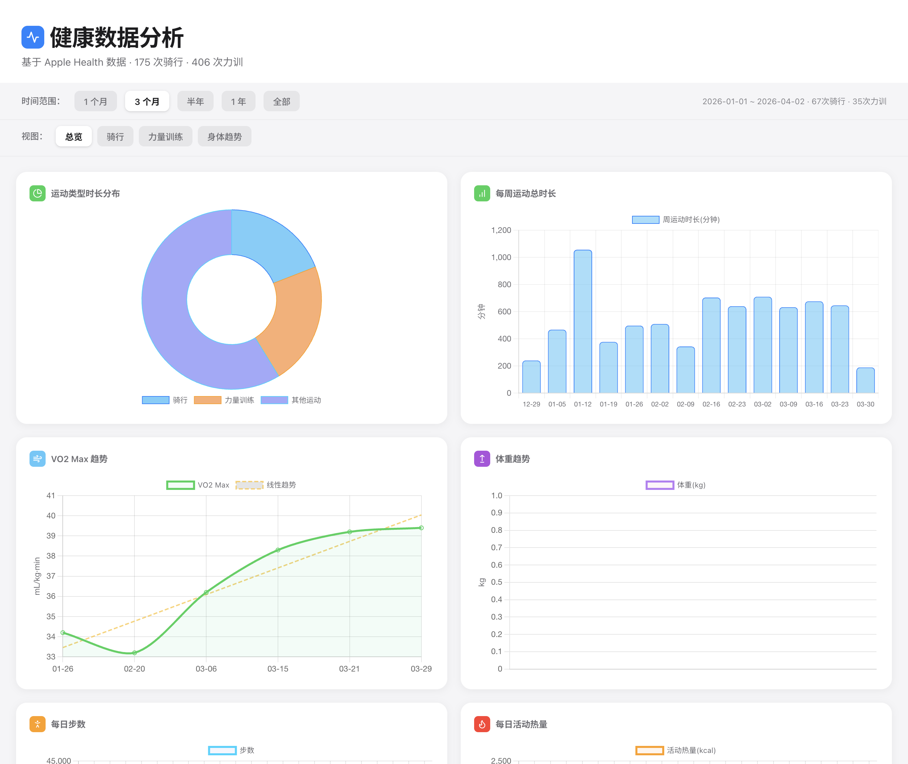
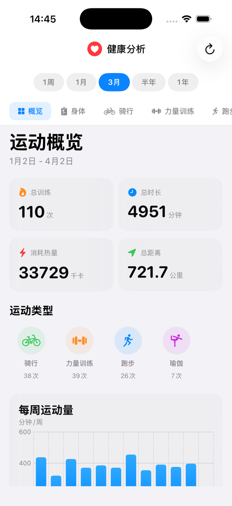
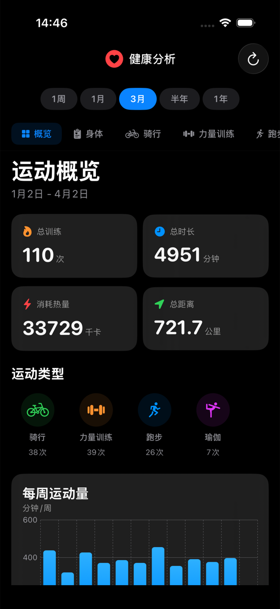
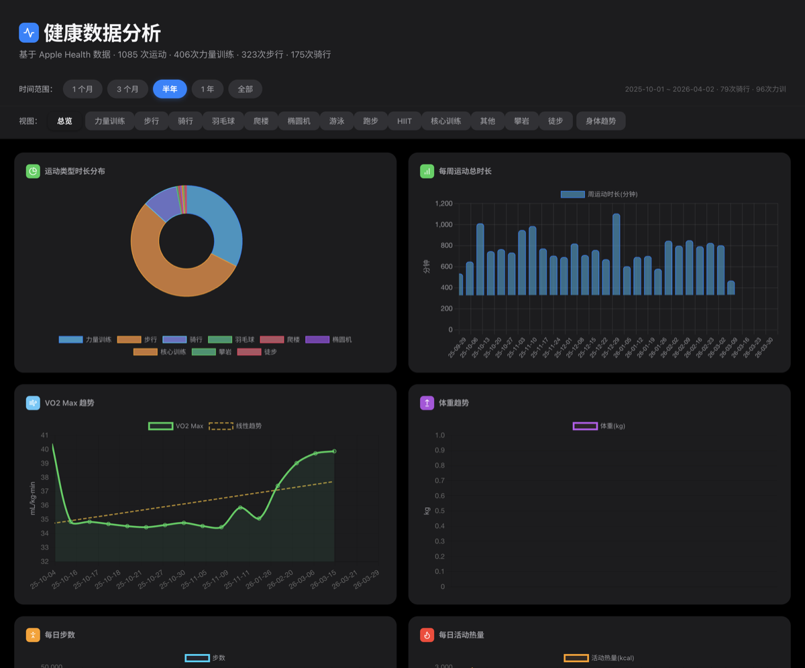
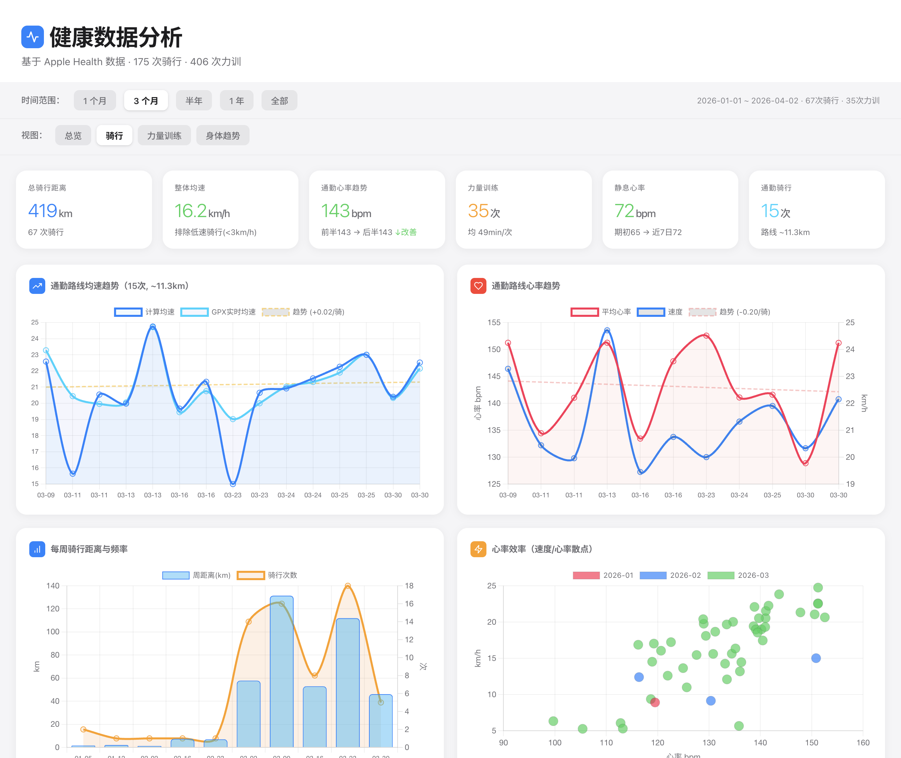
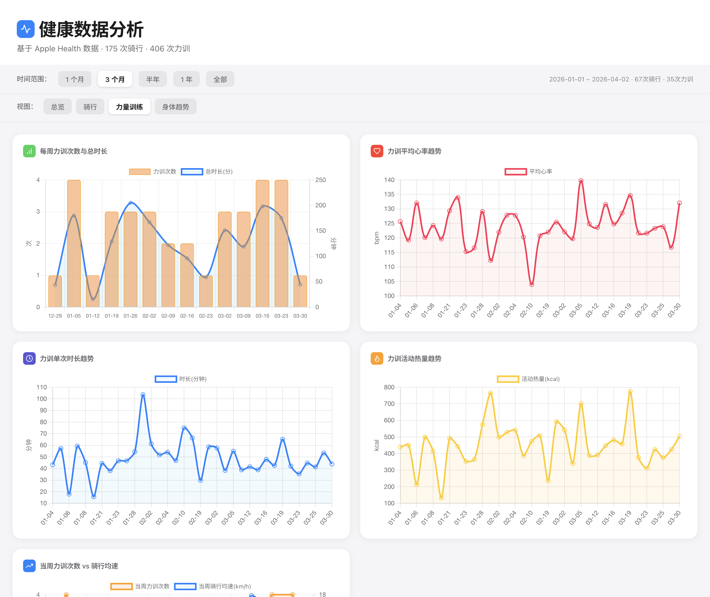
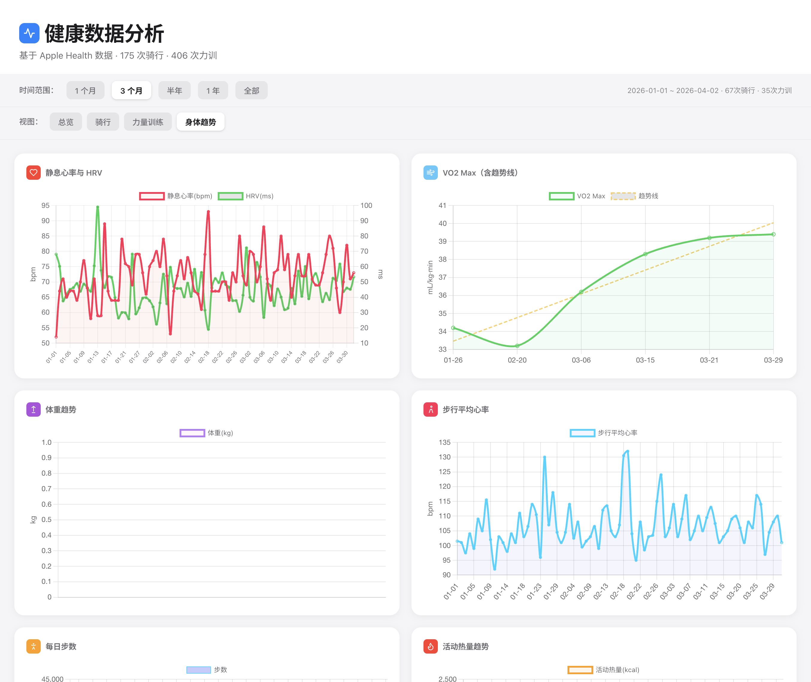

<p align="center">
  
</p>

<h1 align="center">Apple Health Analyzer</h1>

<p align="center">
  <strong>将 Apple Health 数据转化为精美的交互式分析仪表板 — 桌面端 + iOS 原生 App</strong>
</p>

<p align="center">
  
  
  
  
  
  
</p>

---

## 下载安装

| 平台 | 方式 | 说明 |
|------|------|------|
| **iOS** | [源码构建](#方式一ios-app推荐-iphone-用户) | 通过 Xcode 编译安装到 iPhone，直接读取 HealthKit 数据 |
| **macOS** | [源码运行](#方式二python-脚本推荐桌面用户) | `python3 HealthCyclingAnalyzer.py` 一键分析 |
| **Windows** | [源码运行](#方式二python-脚本推荐桌面用户) | 同上，支持 Windows 10/11 |
| **macOS App** | [本地构建](#方式三macos-桌面应用) | PyInstaller 打包为 .app |
| **Windows App** | [本地构建](#方式四windows) | 批处理脚本自动构建 .exe |

> 📦 预编译安装包将在后续 [Releases](https://github.com/JacksonHuang517/apple-health-analyzer/releases) 中提供

---

## 功能特性

### 🍎 iOS 原生 App

直接在 iPhone 上通过 **HealthKit API** 读取健康数据，无需手动导出 XML。

- **原生 SwiftUI** 界面，Apple Health 风格设计
- **Swift Charts** 交互式图表
- **运动概览** · **身体指标** · **睡眠分析** · **运动详情** 四大模块
- 自动识别所有 Apple Watch 运动类型
- 深色模式完美适配

#### 🆕 v3.3 新增数据类型
| 类别 | 指标 |
|------|------|
| 🦶 步态分析 | 步伐不对称性 · 双脚支撑时间 · 步行速度 · 步长 |
| 🫁 呼吸 | 呼吸频率 |
| ⚖️ 身体成分 | 体脂率 · BMI |
| 🏃 活动 | 站立时间 · 步行+跑步距离 |
| 😴 睡眠 | 总睡眠时长 · 深度/REM/核心/清醒阶段 · 睡眠质量评分 |
| 📊 关联分析 | 运动强度 vs 睡眠质量/深度睡眠 · 高低强度日对比 |

### 💻 桌面端

**一键解析** iPhone 健康数据导出（XML + GPX），自动生成一个完全自包含的 HTML 报告，双击即可打开 — 无需服务器、无需网络。支持深色模式。

### 五大分析维度

| 维度 | 分析内容 |
|------|---------|
| **总览** | 运动类型时长分布、每周运动总时长、VO2 Max 趋势、体重变化、每日步数与活动热量、跨运动关联分析 |
| **骑行** | 通勤路线自动识别、均速趋势与线性回归、心率趋势、每周距离/频率、心率效率散点、力训干扰分析、骑行日状态评分 |
| **力量训练** | 每周频率与总时长、平均心率趋势、单次时长趋势、活动热量趋势、力训次数 vs 骑行均速关联 |
| **身体趋势** | 核心指标（心率/HRV/VO2Max/呼吸）· 运动能力（步态分析）· 身体成分（体重/体脂/BMI）· 活动量（步数/热量/距离） |
| **😴 睡眠分析** | 每日睡眠时长、睡眠阶段构成（深度/REM/核心/清醒）、睡眠质量评分趋势、运动强度 vs 睡眠关联分析 |

### 交互功能

- **时间范围选择器** — 1 个月 / 3 个月 / 半年 / 1 年 / 全部
- **多标签页切换** — 总览 / 骑行 / 力量训练 / 身体趋势
- **路线聚类** — 基于 GPS 坐标自动识别通勤/常走路线
- **趋势分析** — 线性回归、均值参考线、前后半段对比

---

## 截图演示

### iOS App

<p align="center">
  
  &nbsp;&nbsp;
  
</p>
<p align="center"><em>左：浅色模式 · 右：深色模式</em></p>

### 桌面端 Dashboard

<details>
<summary><b>🌙 深色模式</b> — 全新深色主题，毛玻璃效果</summary>
<br>

</details>

<details>
<summary><b>🚴 骑行分析</b> — 通勤均速、心率趋势、距离频率、心率效率</summary>
<br>

</details>

<details>
<summary><b>🏋️ 力量训练</b> — 周频率/时长、心率趋势、热量趋势、力训 vs 骑行</summary>
<br>

</details>

<details>
<summary><b>💓 身体趋势</b> — 静息心率/HRV、VO2 Max、体重、步行心率、步数</summary>
<br>

</details>

---

## 快速开始

### 方式一：iOS App（推荐 iPhone 用户）

> 直接在 iPhone 上运行，通过 HealthKit API 读取数据，无需导出 XML。

#### 环境要求

- macOS + [Xcode 16+](https://developer.apple.com/xcode/)（含 iOS 17+ SDK）
- Apple ID（免费个人开发者账号即可）
- iPhone（iOS 17+）或 iOS Simulator

#### 构建步骤

```bash
# 1. 克隆仓库
git clone https://github.com/JacksonHuang517/apple-health-analyzer.git
cd apple-health-analyzer/HealthAnalyzerApp

# 2. 生成 Xcode 项目文件
python3 generate_project.py

# 3. 打开 Xcode 项目
open HealthAnalyzerApp.xcodeproj
```

#### Xcode 配置（首次）

1. 在 Xcode 左侧导航栏点击项目名称 **HealthAnalyzerApp**
2. 选择 **Signing & Capabilities** 标签
3. 勾选 **Automatically manage signing**
4. **Team** 下拉选择你的 Apple ID（Personal Team）
5. 如果 Bundle Identifier 冲突，改为 `com.你的名字.healthanalyzer`

#### 运行到模拟器

1. 顶部设备栏选择一个 iPhone 模拟器（如 **iPhone 17 Pro**）
2. 点击 ▶️ 运行按钮（或菜单 Product → Run）
3. 模拟器中会使用 Mock 数据展示完整 UI

#### 运行到真机

1. 用 **USB 线**连接 iPhone 到 Mac
2. iPhone 上信任此电脑
3. 顶部设备栏切换到你的 **iPhone**
4. 点击 ▶️ 运行
5. 首次运行需在 iPhone 上：**设置 → 通用 → VPN与设备管理** → 信任开发者证书
6. App 启动后会请求 **HealthKit 授权**，允许后即可查看真实健康数据

> 详细真机指南参见 [`HealthAnalyzerApp/REAL_DEVICE_GUIDE.md`](HealthAnalyzerApp/REAL_DEVICE_GUIDE.md)

---

### 方式二：Python 脚本（推荐桌面用户）

```bash
# 1. 克隆仓库
git clone https://github.com/JacksonHuang517/apple-health-analyzer.git
cd apple-health-analyzer

# 2. 创建虚拟环境
python3 -m venv venv
source venv/bin/activate  # Windows: venv\Scripts\activate

# 3. 安装依赖（无额外依赖，仅标准库）
# Python 3.8+ 即可，无需 pip install

# 4. 运行分析
python3 HealthCyclingAnalyzer.py
```

运行后会弹出文件夹选择窗口，选择 Apple Health 导出目录（包含 `导出.xml` 的那个文件夹），程序会自动：
1. 解析 XML 数据和 GPX 路线文件
2. 生成 `analysis_data.json`（结构化数据）
3. 生成 `report.html`（自包含报告，双击即可查看）
4. 自动在浏览器中打开报告

### 方式三：macOS 桌面应用

```bash
# 安装依赖
pip install pyinstaller customtkinter tkinterdnd2

# 构建 .app
pyinstaller build.spec --clean -y
```

构建完成后在 `dist/` 目录下找到 `Apple Health Analyzer.app`，双击运行。

### 方式四：Windows

```bash
# 直接运行批处理脚本（自动安装依赖并构建）
build_windows.bat
```

构建完成后在 `dist\Apple Health Analyzer\` 目录下找到可执行文件。

---

## 数据导出指南

### 第一步：从 iPhone 导出健康数据

1. 打开 iPhone 上的 **「健康」** App（白底红心图标）
2. 点击右上角 **个人头像**
3. 滚动到页面最底部，点击 **「导出所有健康数据」**
4. 系统会提示"正在准备导出数据"，根据数据量可能需要 **1-10 分钟**
5. 导出完成后弹出分享菜单

### 第二步：传输到电脑

| 方式 | 说明 |
|------|------|
| **AirDrop**（推荐） | Mac 用户最快的方式，直接发送到电脑 |
| **隔空投送到文件** | 保存到"文件" App，通过 iCloud Drive 同步 |
| **邮件 / 微信** | 通过邮件或微信发送（文件可能较大，约 50-200MB） |
| **数据线** | 连接电脑，通过 Finder / iTunes 传输 |

### 第三步：解压并使用

1. 收到的文件名为 `导出.zip`
2. **双击解压**，得到 `apple_health_export` 文件夹
3. 文件夹内包含：
   ```
   apple_health_export/
   ├── 导出.xml          ← 主数据文件（所有健康记录）
   ├── 导出_cda.xml      ← 临床数据（可忽略）
   └── workout-routes/   ← GPS 路线数据
       ├── route_2026-01-05.gpx
       ├── route_2026-01-06.gpx
       └── ...
   ```
4. 运行本程序，**选择 `apple_health_export` 文件夹**即可

> **提示**：导出的 XML 文件可能很大（100MB-1GB+），解析需要几十秒到几分钟，请耐心等待。

### 程序读取的数据

| 数据类型 | Apple Health 标识 |
|---------|------------------|
| 骑行 / 力训 / 其他运动 | `Workout` 元素 + `WorkoutStatistics` |
| GPS 路线 & 实时速度 | `workout-routes/*.gpx` |
| 静息心率 | `RestingHeartRate` |
| 心率变异性 (HRV) | `HeartRateVariabilitySDNN` |
| VO2 Max | `VO2Max` |
| 体重 / 体脂率 / BMI | `BodyMass` / `BodyFatPercentage` / `BodyMassIndex` |
| 步数 / 站立时间 | `StepCount` / `AppleStandTime` |
| 活动热量 / 饮食热量 | `ActiveEnergyBurned` / `DietaryEnergyConsumed` |
| 步行心率 / 呼吸频率 | `WalkingHeartRateAverage` / `RespiratoryRate` |
| 步伐不对称性 / 步行速度 / 步长 | `WalkingAsymmetryPercentage` / `WalkingSpeed` / `WalkingStepLength` |
| 睡眠（深度/REM/核心/清醒） | `SleepAnalysis`（HKCategoryTypeIdentifier） |

---

## 技术栈

### iOS App

| 组件 | 技术 |
|------|------|
| UI 框架 | SwiftUI（iOS 17+） |
| 图表 | Swift Charts |
| 健康数据 | HealthKit API |
| 数据模型 | 原生 Swift 结构体 |
| 设计风格 | Apple Health / Fitness 风格 |

### 桌面端

| 组件 | 技术 |
|------|------|
| 桌面 GUI | [CustomTkinter](https://github.com/TomSchimansky/CustomTkinter) — macOS / Windows 11 原生风格自适应 |
| 数据解析 | Python 3 标准库（`xml.etree.ElementTree`） |
| 路线分析 | Haversine 距离计算 + 坐标聚类 |
| 可视化 | [Chart.js 4.4](https://www.chartjs.org/)（内嵌，零 CDN 依赖） |
| 前端设计 | Apple Design 风格 + 深色模式支持 |
| 图标系统 | 内嵌 SVG 图标徽章（Lucide 风格） |
| 拖拽支持 | [tkinterdnd2](https://github.com/pmgagne/tkinterdnd2) — 文件夹拖放识别 |
| 桌面打包 | PyInstaller |

---

## 项目结构

```
.
├── HealthCyclingAnalyzer.py        # 桌面端核心解析与报告生成
├── dashboard.html                  # 桌面端仪表板 HTML 模板（支持深色模式）
├── build.spec                      # PyInstaller 构建配置（macOS）
├── build_windows.bat               # Windows 构建脚本
├── HealthAnalyzerApp/              # iOS App
│   ├── HealthAnalyzerApp/
│   │   ├── App.swift               # App 入口
│   │   ├── ContentView.swift       # 主视图控制器
│   │   ├── Models/
│   │   │   ├── HealthModels.swift  # 数据模型
│   │   │   └── MockData.swift      # 模拟器测试数据
│   │   ├── HealthKit/
│   │   │   ├── HealthKitManager.swift      # HealthKit 数据读取
│   │   │   ├── NativeDataTransformer.swift # HK → 原生模型转换
│   │   │   └── DataTransformer.swift       # HK → JSON 转换（兼容）
│   │   └── Views/
│   │       ├── NativeDashboardView.swift   # 主仪表盘（Tab + 时间选择器）
│   │       ├── OnboardingView.swift        # 引导页
│   │       ├── LoadingView.swift           # 加载动画
│   │       ├── Tabs/
│   │       │   ├── SummaryTab.swift        # 运动概览
│   │       │   ├── BodyTab.swift           # 身体指标（4子分类）
│   │       │   ├── SleepTab.swift          # 睡眠分析 + 运动关联
│   │       │   └── WorkoutDetailTab.swift  # 运动详情
│   │       └── Components/
│   │           ├── MetricCard.swift        # 指标卡片组件
│   │           └── ChartCards.swift        # 图表卡片组件
│   ├── generate_project.py         # Xcode 项目文件生成器
│   └── REAL_DEVICE_GUIDE.md        # 真机测试详细指南
├── screenshots/                    # README 截图
└── README.md
```

---

## License

MIT License — 自由使用，欢迎贡献。
